# 📐 Patrones de Diseño en Programación Orientada a Objetos

---

## 🎯 Resumen

Este repositorio constituye una exploración concisa y práctica de los patrones de diseño esenciales dentro del paradigma de la Programación Orientada a Objetos (POO). Cada patrón se presenta con una definición clara de su propósito, directrices estratégicas para su aplicación y ejemplos concretos que facilitan una comprensión profunda y una implementación efectiva en escenarios del mundo real.

---

## 🧩 Patrones de Diseño Implementados

## 🛠️ Factory Method

**Objetivo:** Define una interfaz para la creación de objetos, delegando la decisión de la clase concreta a las subclases. Este enfoque encapsula la lógica de instanciación, promoviendo un diseño flexible y altamente reutilizable.

### Aplicación Estratégica:

- Cuando una clase no puede prever el tipo exacto de objetos que necesita instanciar.
- Para permitir que las subclases especifiquen los tipos de objetos a crear.
- Para simplificar la creación de objetos complejos, minimizando el acoplamiento a implementaciones concretas.

### Arquitectura:
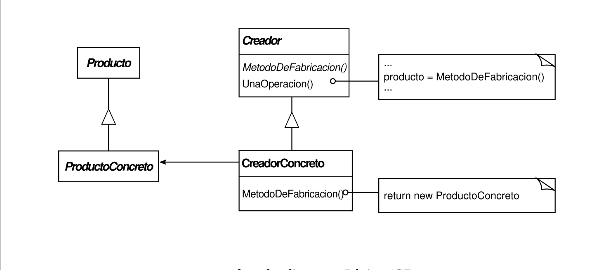

### Implementación Concreta:
En este proyecto, el patrón Factory Method se ejemplifica mediante la generación dinámica de elementos en un entorno 
de mapa. Se define un `Creator` abstracto para la creación de elementos, con implementaciones especializadas 
como `CreatorB` para la instanciación de bombas en las paredes y `CreatorBlind` para la creación de blindaje
en las puertas del laberinto..

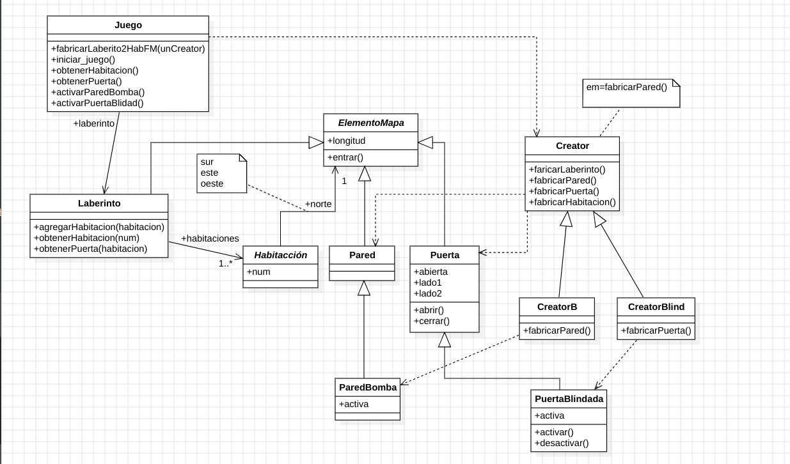

### Diagrama de secuencia Crear Laberinto 2 Habitaciones con Paredes Bomba
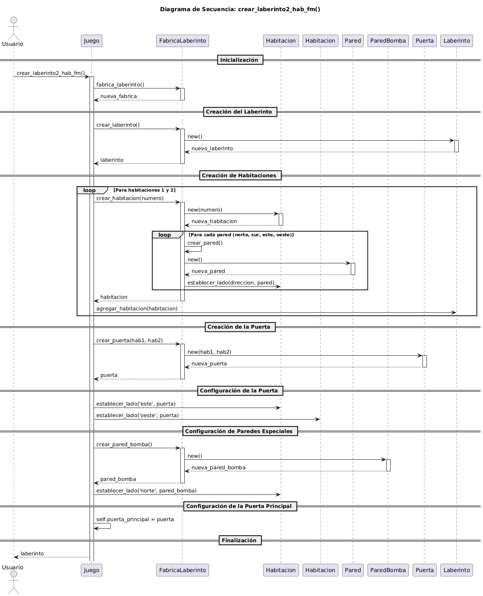

## 🛠️ Decorator

**Objetivo:** Permite añadir responsabilidades adicionales a un objeto de forma dinámica, sin alterar su estructura 
fundamental. Ofrece una alternativa flexible y poderosa a la herencia para la extensión de funcionalidades.

### Aplicación Estratégica:
- Para la adición dinámica y transparente de funcionalidades a objetos individuales.
- Para evitar la creación de jerarquías de herencia profundas y complejas con múltiples subclases.
- Cuando la adición de comportamientos es opcional o debe variar en tiempo de ejecución.

### Arquitectura:
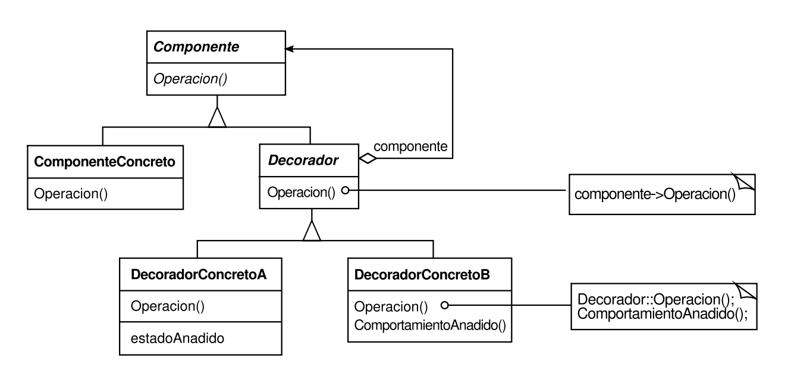

### Implementación Concreta
En este ejemplo, el patrón Decorator se utiliza para enriquecer dinámicamente los elementos del mapa con 
funcionalidades como "bomba" y "pintura" para pared y "Llave"/Sonido a puerta, extendiendo su comportamiento sin modificar sus clases base.

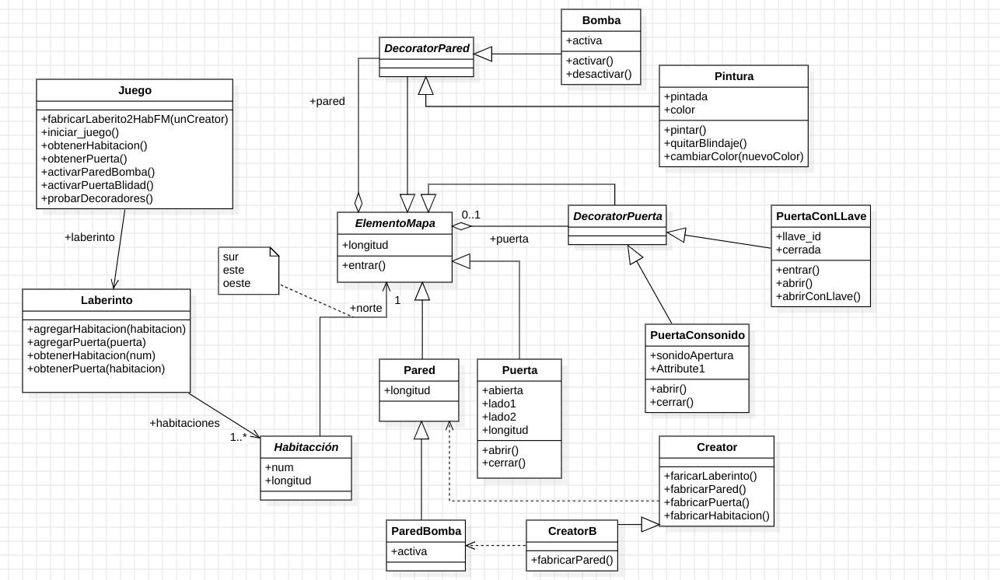

### Diagrama de secuencia del decorator pintura aplicado una pared
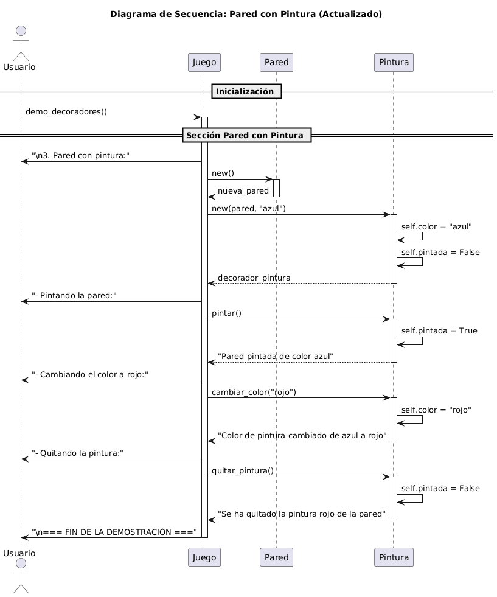

## ⚙️ Strategy
**Objetivo:** Define una familia de algoritmos, los encapsula como objetos y los hace intercambiables 
en tiempo de ejecución. Esto permite la variación del comportamiento de un objeto independientemente de su tipo.

### Aplicación Estratégica:
- Cuando existen múltiples algoritmos para una tarea específica y se requiere la capacidad de alternar 
entre ellos dinámicamente.
- Para mitigar la proliferación de estructuras condicionales complejas (`if-else`) dentro de una clase.
- Para encapsular algoritmos individuales, fomentando su reutilización y mantenibilidad.

### Arquitectura:
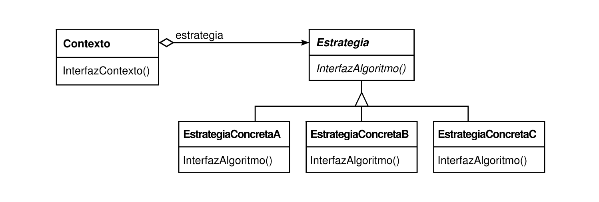

### Implementación Concreta:
El patrón Strategy se aplica para la implementación de diversos tipos de bombas como **Broma**, **Mina** y 
**Destructiva**, también para distintas estrategias de modo el los bichos, cada una con un 
comportamiento distintivo, siguiendo una arquitectura de diseño adaptable y extensible.

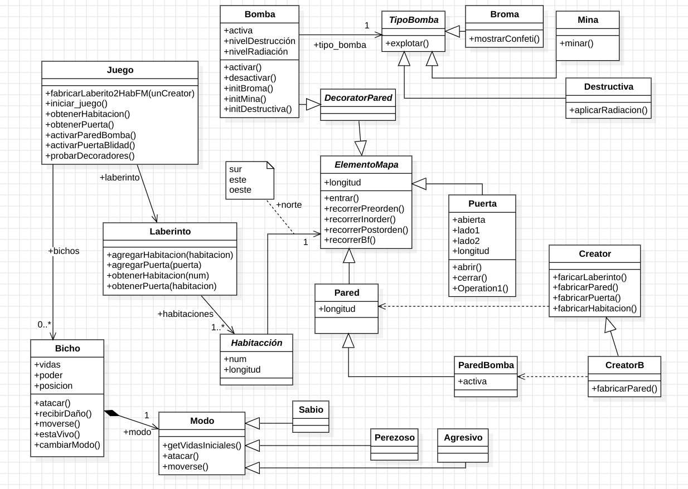

### Diagrama de secuencia del método probar bichos
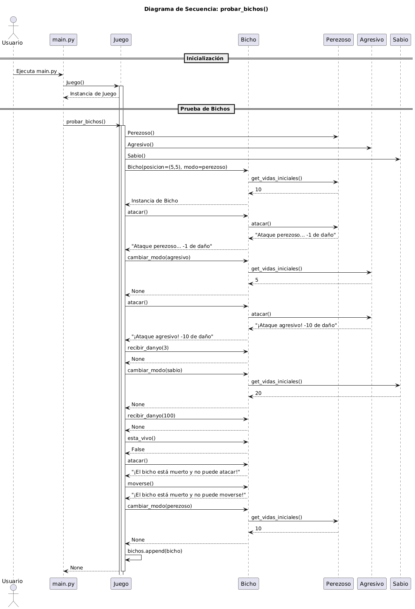

## 🌳 Composite
**Objetivo:** Permite tratar objetos individuales y composiciones de objetos de manera uniforme. 
Facilita la construcción de estructuras de objetos jerárquicas y la manipulación coherente de sus componentes.

### Aplicación Estratégica:
- Cuando se necesita representar una estructura jerárquica de objetos con relaciones parte-todo.
- Para permitir que los clientes interactúen con objetos individuales y compuestos de forma indistinta.
- Para simplificar la gestión y manipulación de estructuras de datos complejas.

### Arquitectura:
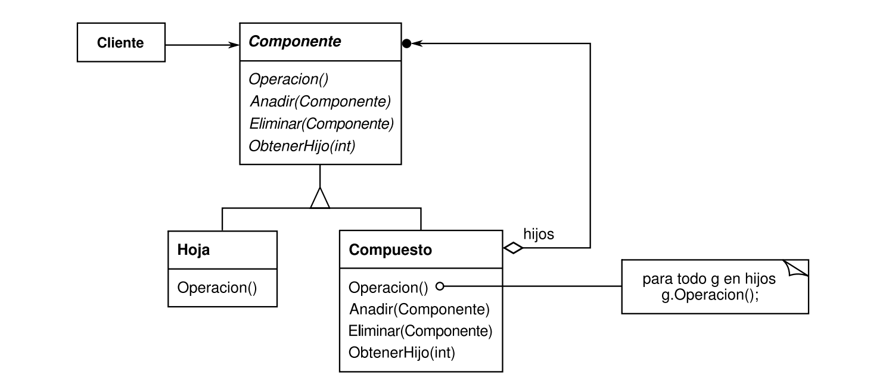

### Implementación Concreta:

El patrón Composite se implementa mediante una jerarquía donde `ElementoMapa` es la interfaz común, 
con `Contenedor` y `Hoja` como implementaciones. Los `MuebleCompuesto` pueden contener otros muebles, 
mientras que `MuebleSimple` son hojas. Las orientaciones (`Norte`, `Sur`, `Este`, `Oeste`) 
son Singletons para garantizar consistencia. Cada elemento tiene dimensiones y orientación, 
permitiendo estructuras anidadas complejas. Los métodos como `entrar()` y `mostrar_estructura()` 
funcionan tanto en elementos individuales como en composiciones, demostrando la transparencia del patrón.

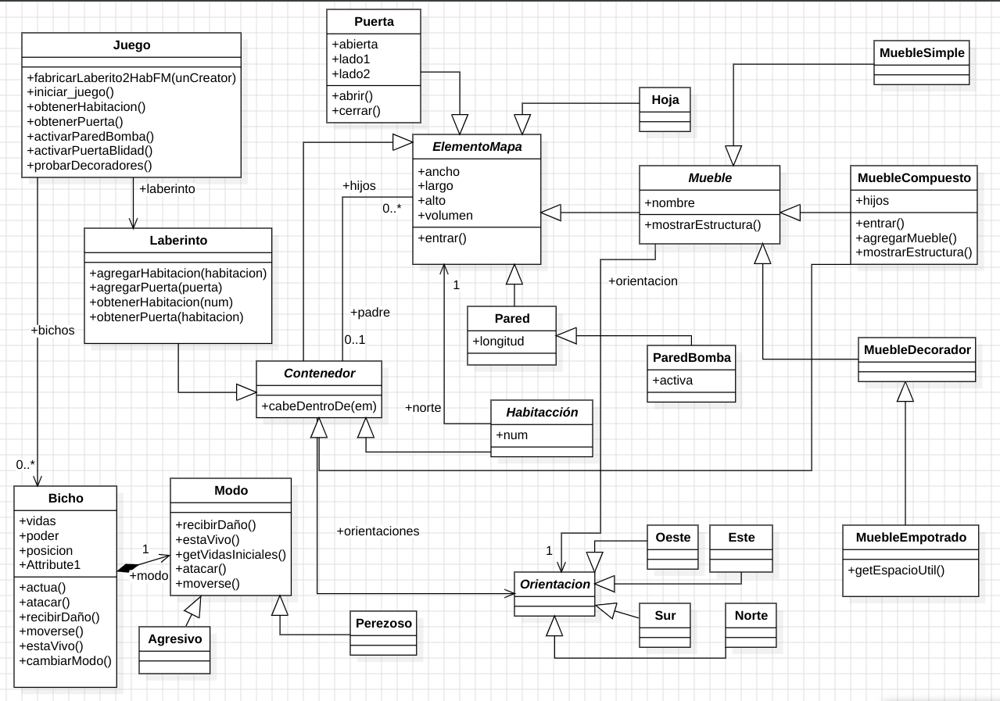

### Diagrama de secuencia del Composite
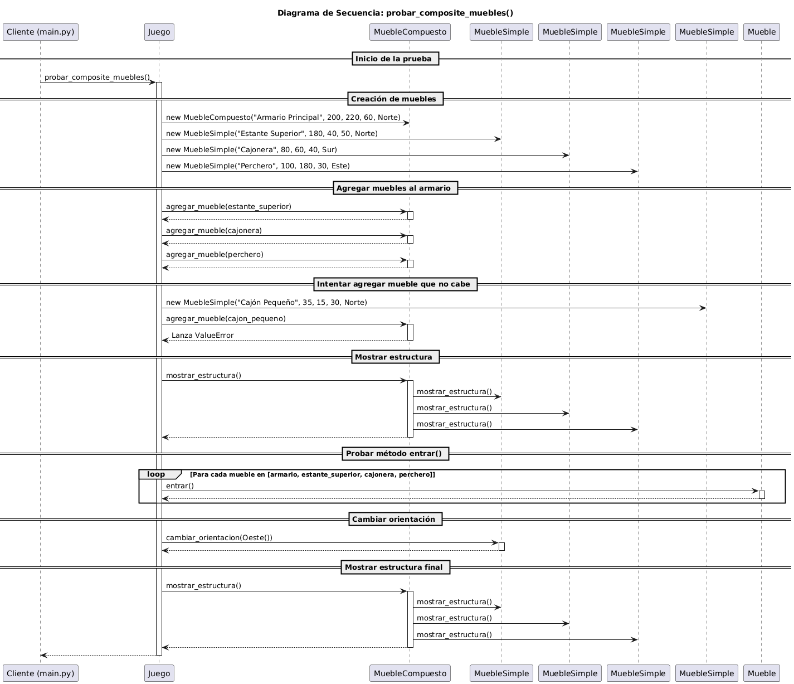

## 🧱 Builder
**Objetivo:** Separa la construcción de un objeto complejo de su representación, de manera que el mismo 
proceso de construcción puede crear diferentes representaciones.

### Aplicación Estratégica:
- Cuando el proceso de construcción de un objeto complejo es independiente de las partes que lo 
componen y de cómo se ensamblan.
- Para simplificar la creación de objetos complejos con múltiples configuraciones posibles, evitando 
constructores con un gran número de parámetros.

### Arquitectura:
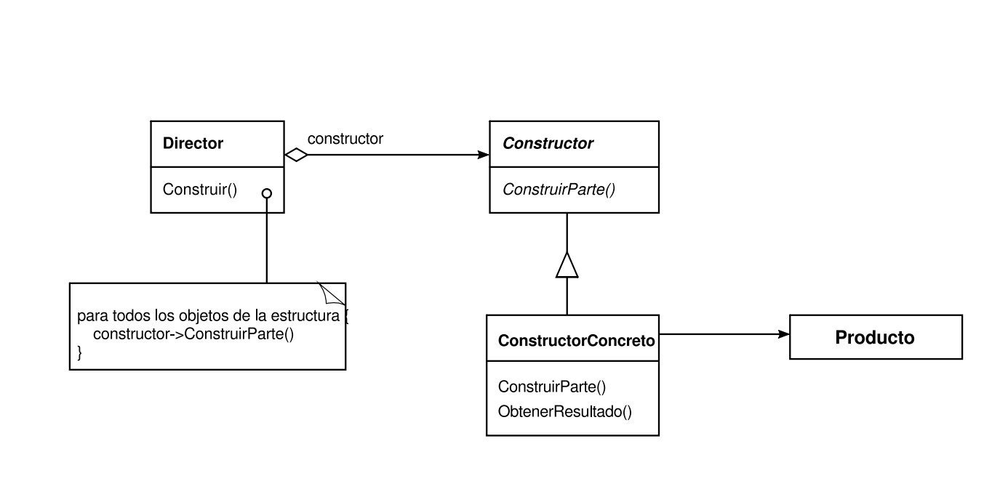

### Implementación Concreta:

El patrón Builder se implementa a través de dos componentes principales: el `Director` que orquesta la 
construcción, el `LaberintoBuilder` que define la interfaz de construcción. 
El Director interpreta un archivo JSON, crea habitaciones con `fabricar_habitacion()`, 
las conecta mediante puertas con `fabricar_puerta()`, y añade bichos con características específicas. 
Esta separación permite construir laberintos complejos de manera flexible y mantenible, facilitando 
la adición de nuevos elementos sin modificar la lógica existente.

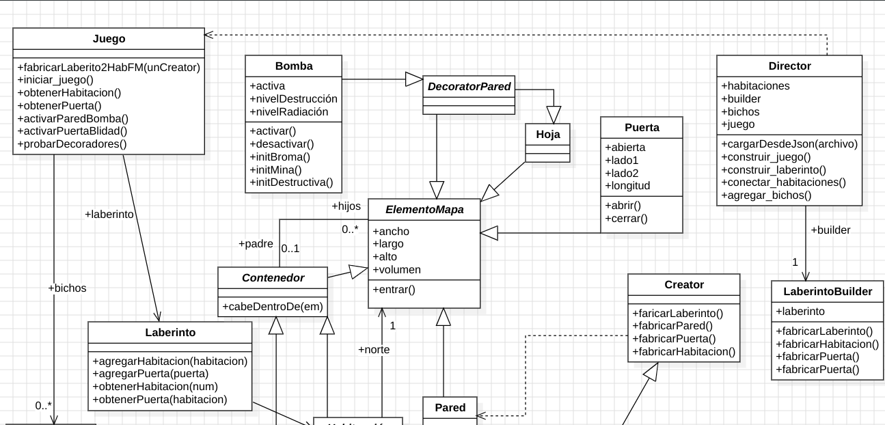

### Diagrama de secuencia del del juego
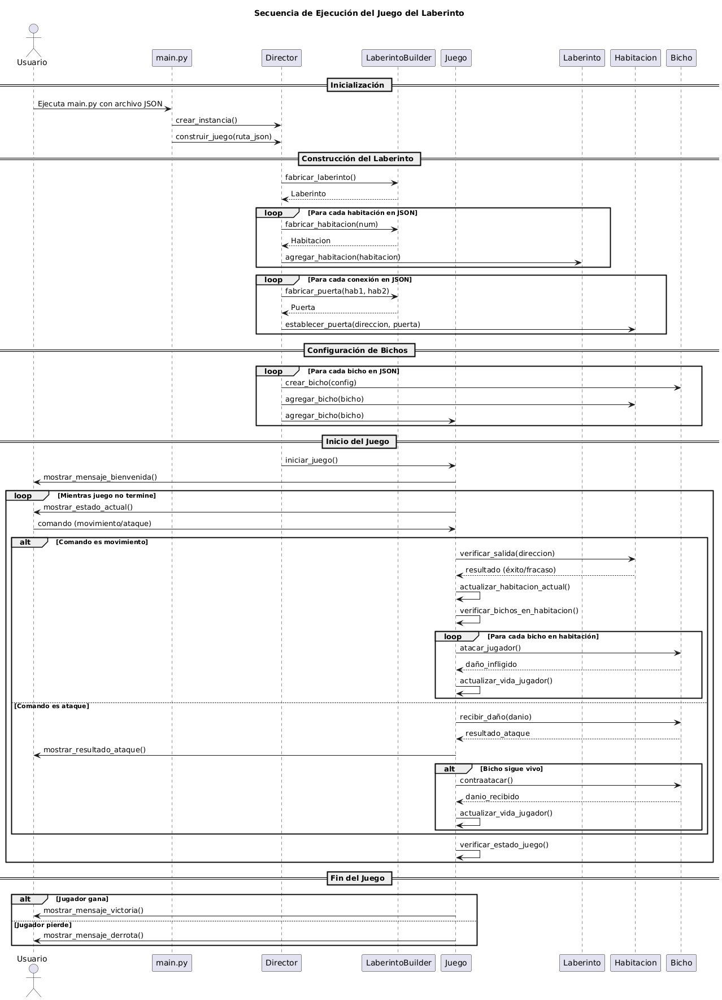

